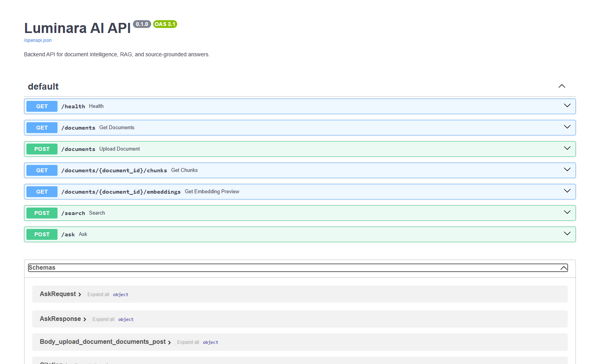

# 🌌 Luminara AI — Transparent RAG Knowledge Base

**Luminara AI** is a fullstack Retrieval-Augmented Generation (RAG) platform that transforms documents into a **traceable, evidence-based AI assistant**.

> 🔍 Not just answers — but answers you can verify.

---

## 🚀 Overview

Most “chat with documents” tools behave like black boxes.

Luminara AI is designed differently:

* every answer is grounded in real data
* every claim is backed by sources
* every retrieval step is visible

---

## 🧠 Core Idea

Instead of:

> “Trust the AI”

Luminara provides:

> “Here is the answer — and exactly where it came from.”

---

## ✨ Key Features

### 📂 Multi-Format Document Ingestion

* Upload:

  * PDF
  * DOCX
  * Markdown
  * TXT
* Automatic text extraction

---

### 🧩 Intelligent Chunking

* Documents split into overlapping chunks
* Preserves context across boundaries
* Optimized for semantic retrieval

---

### 🧠 Embeddings & Vector Search

* Embeddings generated via OpenAI or local fallback
* Stored in **Qdrant vector database**
* Fast and scalable semantic search

---

### 🔎 Retrieval-Augmented Generation (RAG)

Pipeline:

```
Query → Vector Search → Relevant Chunks → Prompt → LLM → Answer
```

---

### 📑 Evidence-Based Answers

* Inline citations
* Source snippets
* Grounded responses only

---

### 🔍 Retrieval Transparency (Key Feature)

Users can inspect:

* Retrieved chunks
* Semantic similarity scores
* Context used for generation

This makes the system:

* debuggable
* explainable
* trustworthy

---

### ⚙️ Answer Modes

Control how the AI behaves:

* **Strict**

  * Only uses retrieved data
  * No assumptions

* **Balanced**

  * Combines retrieval + reasoning

* **Exploratory**

  * More flexible, allows extrapolation

---

### 🧪 Local Embedding Fallback

* Works without OpenAI API key
* Uses local embedding models
* Useful for offline or cost-sensitive environments

---

### 📊 Modern Dashboard UI

* Built with Next.js
* Clean knowledge-base interface
* Interactive retrieval trace panel

---

## 🏗 Architecture

### End-to-End Pipeline

```
Document Upload
      ↓
Text Extraction
      ↓
Chunking (with overlap)
      ↓
Embedding Generation
      ↓
Qdrant Indexing
      ↓
Semantic Retrieval
      ↓
RAG Prompt Construction
      ↓
LLM Answer + Citations
      ↓
UI Trace Visualization
```

---

## 🧩 Tech Stack

### Frontend

* Next.js
* React
* TypeScript
* Tailwind CSS
* Lucide Icons

### Backend

* FastAPI
* Python
* Pydantic
* OpenAI SDK
* Qdrant Client
* pypdf, python-docx

### Infrastructure

* Docker Compose
* Qdrant Vector Database

---

## 🔄 Data Flow

```
Frontend → FastAPI → Embedding Service → Qdrant → LLM → Response → UI
```

---

## 🧠 Why This Project Matters

This project demonstrates:

* Advanced RAG system design
* Vector databases (Qdrant)
* Embedding pipelines
* AI system transparency & observability
* Fullstack AI architecture (Next.js + FastAPI)
* Real-world LLM product thinking

---

## 📸 Screenshots

### Dashboard


### RAG Answer with Citations


### Retrieval Trace Panel


### Backend API (Swagger)



---

## 🔐 Design Principles

### 1. Transparency over Magic

Users can inspect how answers are generated.

### 2. Grounding over Hallucination

Answers must come from retrieved data.

### 3. Debuggability

System is built so developers can trace failures.

---

## 💡 Future Improvements

* Hybrid search (BM25 + vector)
* Document versioning
* Multi-user workspaces
* Access control & permissions
* Streaming responses
* Agent-based workflows (multi-step reasoning)
* Fine-tuned embedding models

---

## 📄 License

MIT License

---

## 👤 Author

**Vladimir**
AI Developer · Fullstack Builder
