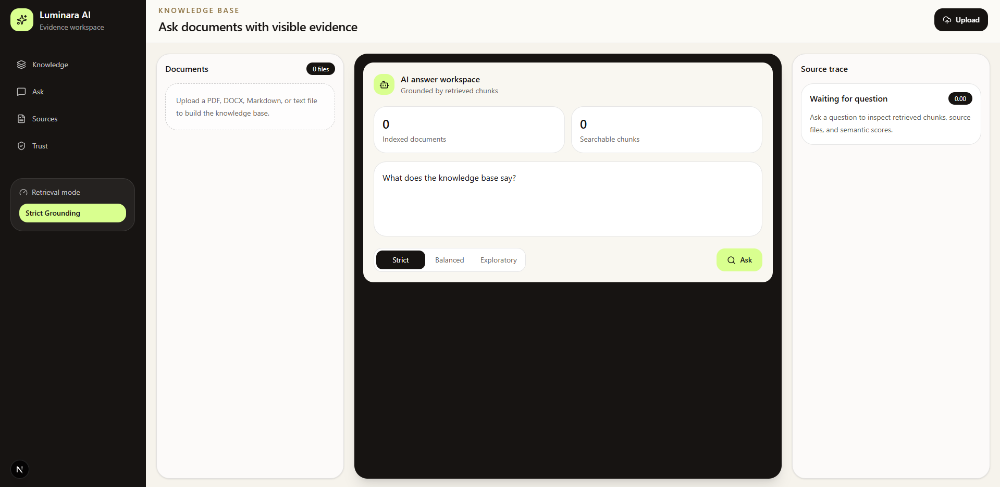
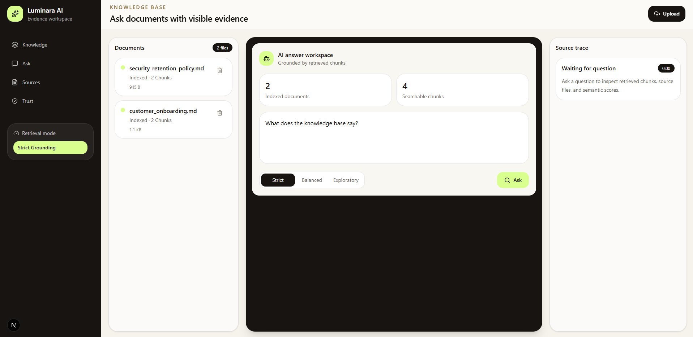
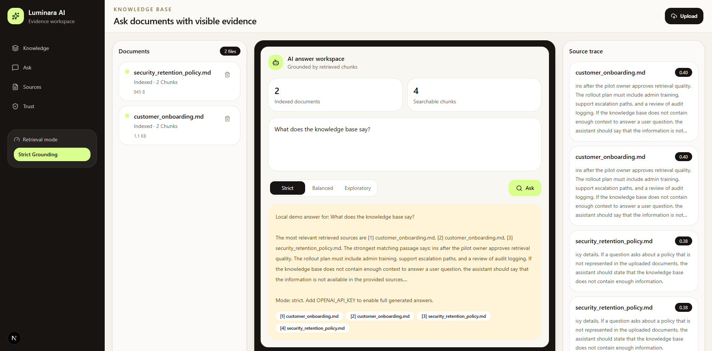

# Luminara AI

**Luminara AI** is a fullstack RAG knowledge-base platform that turns documents into an evidence-based AI assistant.

Upload PDFs, DOCX files, Markdown, or text documents. Luminara extracts the content, splits it into searchable chunks, creates embeddings, stores them in Qdrant, and answers questions with citations and retrieval traces.

The goal of this project is not just to build another “chat with PDF” demo. Luminara AI is designed around transparency: users can inspect which document chunks were retrieved, how relevant they were, and which sources support the answer.

## Why This Project Exists

Most AI document tools feel like a black box.

Luminara AI focuses on three things:

- **Grounded answers**: responses are based on retrieved document chunks.
- **Visible evidence**: every answer includes citations and source snippets.
- **Inspectable retrieval**: users can see semantic scores and retrieved context.

This project was built as a portfolio piece for **AI Builder / Fullstack Developer** roles.

## Features

- Upload `.pdf`, `.docx`, `.md`, and `.txt` files
- Extract text from documents
- Split documents into overlapping chunks
- Generate embeddings
- Use Qdrant for vector search
- Ask questions against the knowledge base
- Generate RAG answers with citations
- Show retrieval trace with semantic scores
- Support answer modes:
  - `strict`
  - `balanced`
  - `exploratory`
- Local embedding fallback when no OpenAI API key is configured
- Modern Next.js dashboard UI

## Tech Stack

### Frontend

- Next.js
- React
- TypeScript
- Tailwind CSS
- Lucide icons

### Backend

- FastAPI
- Python
- Pydantic
- OpenAI SDK
- Qdrant client
- pypdf
- python-docx

### Infrastructure

- Docker Compose
- Qdrant vector database

## Architecture

```text
Document Upload
      ↓
Text Extraction
      ↓
Chunking With Overlap
      ↓
Embedding Generation
      ↓
Qdrant Vector Indexing
      ↓
Semantic Search
      ↓
RAG Prompt Construction
      ↓
Answer With Citations
      ↓
Retrieval Trace In UI


```

## Screenshots

### Dashboard



### RAG Answer With Citations



### Source Trace



### Backend API


